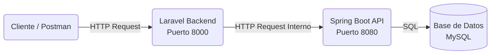

# DWES06 - Sistema de Gestión de Incidencias

## 📋 Descripción General

Este proyecto implementa una arquitectura de **Microservicios** para la gestión de incidencias de una empresa. El sistema desacopla la lógica de validación y control de la lógica de negocio y persistencia, utilizando dos tecnologías principales que se comunican vía HTTP.

### 🏗️ Arquitectura del Sistema

El proyecto se divide en dos componentes principales que trabajan en conjunto:

1. **Controlador Frontend (Backend Laravel)**: Actúa como puerta de entrada y validador.
2. **Microservicio de Datos (Spring Boot)**: Gestiona la lógica de negocio y la base de datos.

---

## 🚀 Componentes del Proyecto

### 1. [Backend Laravel](backend/my_api_rest/README.md)
**Ruta:** `./backend/my_api_rest`

Este componente desarrollado en **Laravel** es el encargado de recibir las peticiones HTTP externas (por ejemplo, desde Postman). Su función principal es:
- **Validar** los datos de entrada según las reglas de negocio.
- **Controlar** el flujo de la petición.
- **Orquestar** la comunicación con el microservicio Spring Boot.
- **Formatear** la respuesta final para el cliente.

📄 **[Ver Documentación Completa del Backend](backend/my_api_rest/README.md)**

### 2. [Microservicio Spring Boot](microservicio/spring_my_api_rest/README.md)
**Ruta:** `./microservicio/spring_my_api_rest`

Este microservicio desarrollado en **Spring Boot** contiene el núcleo de la lógica de negocio. Recibe las peticiones ya validadas desde el backend Laravel y se encarga de:
- **Gestionar** las operaciones CRUD (Create, Read, Update, Delete) sobre la base de datos.
- **Interactuar** directamente con **MySQL** para la persistencia de datos.
- **Devolver** los resultados o errores en formato JSON puro.

📄 **[Ver Documentación Completa del Microservicio](microservicio/spring_my_api_rest/README.md)**

---

## 🛠️ Recursos Adicionales

En la raíz del proyecto se incluyen recursos esenciales para el despliegue y pruebas del sistema:

### 🗄️ Base de Datos
- **Archivo:** `Creacion_BD_y_tablas_Incidencias.sql`
- **Descripción:** Script SQL necesario para generar el esquema de base de datos `incidencias`, incluyendo las tablas `trabajadores`, `instalaciones` e `incidencias` con sus datos iniciales y relaciones.

### 🧪 Pruebas API
- **Archivo:** `garcia_conde_jose_DWES06_TE01_postman_collection.json`
- **Descripción:** Colección de Postman configurada con todas las peticiones necesarias para probar el flujo completo del sistema (GET, POST, PUT, DELETE) contra el backend Laravel.

## 👨‍💻 Autor

**José García Conde**  
Desarrollo Web en Entorno Servidor (DWES)
Tarea Evaluativa 01 - Unidad 06